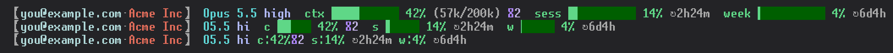
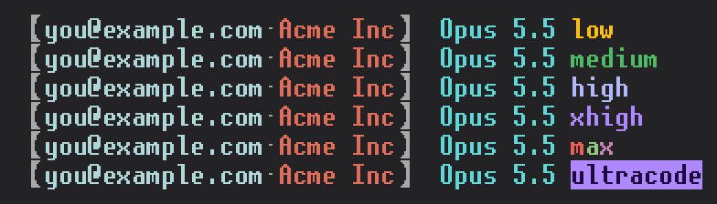

# claude-statusline

A status line for [Claude Code](https://claude.com/claude-code) showing the account
in use, the model and its effort level, context fill, and both usage quotas with their reset countdowns.
Layout collapses in three steps as the terminal narrows.



Percentages are colored green below 50%, yellow from 50%, red from 80%. Bars use
partial-block glyphs for eighth-of-a-cell resolution, so a 10-cell bar has 80
distinct levels.

The effort level (`low`, `medium`, `high`, `xhigh`, `max`) takes the colors the `/effort` picker gives it in the dark theme: yellow, green, pale blue, purple, and a rainbow for `max`. The picker animates the top two; the status line cannot, so `xhigh` gets the plain purple and `max` a per-letter rainbow. Models without effort support (Haiku) show no effort segment. Ultracode (xhigh plus workflow orchestration, team and enterprise plans) is shown as a filled purple `ultracode` badge, `ultra` below 90 columns; see the notes below for how it is detected.



`ⴵ2` after the context meter counts how many times the conversation has been compacted. It is the number of `compact_boundary` records in the transcript, so it survives `--resume` and starts over after `/clear`, and it is hidden until the first compaction. A small cache per transcript keeps the count and the byte offset it covers, so each render reads only what was appended since.

## Install

```bash
git clone https://github.com/emoryy/claude-statusline ~/src/claude-statusline
chmod +x ~/src/claude-statusline/statusline.sh
```

Then in `~/.claude/settings.json`:

```json
{
  "statusLine": {
    "type": "command",
    "command": "bash /home/you/src/claude-statusline/statusline.sh"
  }
}
```

### Requirements

| Dependency | Used for |
|---|---|
| bash 4+ | arrays, `${var^^}` |
| `jq` | parsing the status line JSON, the account file and the API response |
| `curl` | fetching usage |
| GNU coreutils `date` | `date -d <iso8601>` for reset countdowns |
| `awk` | compact token formatting |
| `stty` (or tmux, or `tput`) | detecting the real terminal width |

macOS ships BSD `date`, which has no `-d`. Install `coreutils` and put `gdate`
ahead of it on `PATH`, or the reset countdowns are simply omitted (nothing else
breaks).

Your terminal font needs U+2588 to U+258F (block elements) and the fullwidth
brackets 【】. Without them the bar and the account tag misalign. Any font with
decent Unicode coverage (most Nerd Fonts, DejaVu Sans Mono, Iosevka) is fine.

## Usage quotas, and what they cost you

The `sess` (5 hour) and `week` (7 day) figures come from
`https://api.anthropic.com/api/oauth/usage`, the endpoint behind the `/usage`
command. To call it the script reads your OAuth access token out of
`$CLAUDE_CONFIG_DIR/.credentials.json` and sends it to that host as a bearer
token. The token is never printed, logged or written anywhere.

Read that paragraph before installing. If you would rather not have a shell
script touch your credentials, delete the "Fetch usage from API" block. The
account tag, model and context meter all work without it, and the two quota
slots render a dim `n/a`.

The endpoint is undocumented and can change or disappear without notice. Every
failure path degrades to `n/a` or to the last known figures rather than showing
a misleading 0%. `n/a` also appears when authenticating with an API key instead
of a subscription, or when credentials live in an OS keychain rather than in
`.credentials.json`.

Responses are cached for 5 minutes in `$CLAUDE_CONFIG_DIR/usage-cache.json`, so
the status line does not issue a request per render.

## Configuration

All optional; the defaults need no setup.

| Variable | Effect |
|---|---|
| `STATUSLINE_LABEL` | Replaces the account label. Default: the OAuth email, or the config directory's name when there is no OAuth account. |
| `STATUSLINE_ORG` | Forces the org segment text. `-` suppresses it. Default: the organization name for team and enterprise orgs, nothing otherwise. |
| `STATUSLINE_ORG_FALLBACK` | Org segment text used only when *no* team or enterprise org is active, e.g. `personal`. Rendered dim. Lets a config dir you expect to be on a team org flag when it isn't. |
| `STATUSLINE_ACCOUNT_COLORS` | Pins label colors per account: `"a@b.com=152,c@d.com=#c8b28a"`. Default: a color hashed from the label. |
| `STATUSLINE_ORG_COLOR` | Color of the org segment. Default: a warm brick `38;2;224;108;90`. |
| `STATUSLINE_CACHE_FILE` | Where to keep the usage cache. |
| `STATUSLINE_CACHE_TTL` | Cache lifetime in seconds. Default 300. |
| `STATUSLINE_COLS` | Forces a terminal width. Useful for testing the collapsed layouts. |
| `STATUSLINE_STATE_DIR` | Where the per-process ultracode state files and the per-transcript compaction counts go. Default: `$XDG_RUNTIME_DIR/claude-statusline`, or `/tmp/claude-statusline`. |

Colors accept an xterm-256 index (`152`), a hex triplet (`#98c0c0`), or a raw SGR
parameter string (`38;5;152`).

Set these in the `statusLine.command` itself, since the status line does not
inherit your interactive shell's environment:

```json
"command": "STATUSLINE_ORG=personal bash /home/you/src/claude-statusline/statusline.sh"
```

### Running two accounts side by side

With `CLAUDE_CONFIG_DIR` pointing at separate directories per account, each gets
its own label and a different hashed color, so a glance at the tag tells you
which account is spending. Pin the colors if you want them stable:

```json
"command": "STATUSLINE_ACCOUNT_COLORS=you@work.com=152,you@gmail.com=187 bash /home/you/src/claude-statusline/statusline.sh"
```

## Layout tiers

| Width | Layout |
|---|---|
| ≥ 100 | full, plus `(used/total)` token counts on the context meter |
| ≥ 90 | full labels, 10-cell bars |
| 70-89 | initials for labels, 5-cell bars, model abbreviated to `O5` / `H4.5`, effort to `lo` / `med` / `hi` / `xhi` / `max` |
| < 70 | labels and percentages only, no bars |

A `[1m]` long-context marker in the model name becomes a trailing `+` (`S5+`).

## Notes

The screenshots are drawn from the script's real output on synthetic data (no account, no API call) by `docs/make-screenshots.py`, in unscii without anti-aliasing. It needs Python with Pillow and fontTools.

The bracket color tracks the `/color` session setting. That setting is not
exposed to status line scripts, so it is recovered by grepping the transcript for
the line Claude Code writes when it changes (`Session color set to: <name>`).
If that internal string ever changes the brackets fall back to gray. The grep
reads the whole transcript on every render; at 21 MB that measured 7 ms.

Ultracode is not in the status line JSON either, which reports it as `xhigh`. At `xhigh` the script reconstructs it from the transcript: the output of `/effort` and of the `/model` picker's effort row is written there at once, and on the next prompt Claude Code adds an `ultra_effort_enter` or `ultra_effort_exit` attachment derived from the real state. The latest of these wins. The patterns match unescaped JSON structure, so copies of those strings quoted in tool output or messages do not count. Ultracode is session-only and is not restored on `--resume`, so only records written since the running Claude process started count. The process is found by walking up from the script's parent in `/proc`, and a small state file per process (see `STATUSLINE_STATE_DIR`) carries the state across `/clear` and in-app `/resume`, remembers `--effort ultracode` and the `ultracode` settings key from startup, and lets later renders read only the bytes added since the previous one. Ultracode also needs dynamic workflows, so `enableWorkflows: false` in the settings files or `CLAUDE_CODE_DISABLE_WORKFLOWS` keeps the badge off. Where `/proc` is missing (macOS) the script falls back to the latest record in the whole transcript.

Two ways of changing it leave no trace in the transcript: the model picker's keyboard shortcut and Remote Control. After those the badge is wrong until the next prompt, or for the rest of the session if ultracode was switched on and back off with no prompt in between. Org policy switching workflows off is not visible to the script either.

## License

MIT. See [LICENSE](LICENSE).
